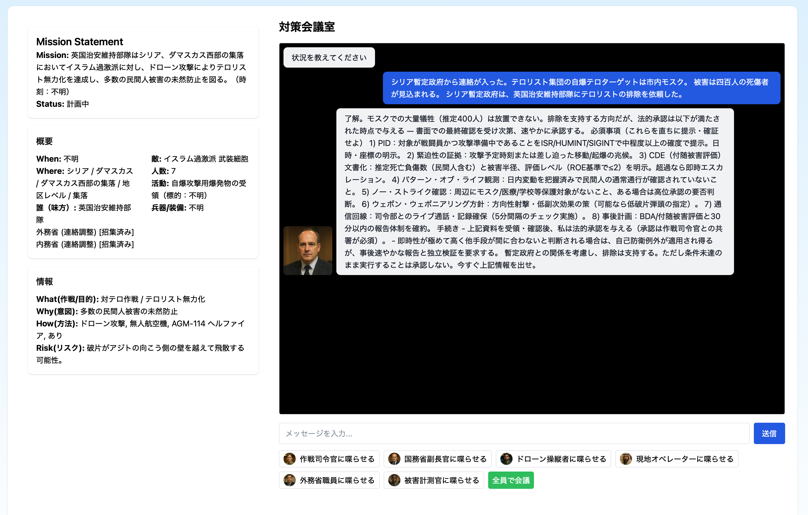

# Chat RPG - Multi-Agent Meeting Simulator

このリポジトリは、OpenAI (GPT-4o/GPT-5等) を活用した多人数ロールプレイ・チャット会議ゲーム雛形です。
Next.js + React + TypeScript + Tailwind CSS構成で、シナリオをXML管理し、複数NPC＋プレイヤーが独立したコンテキスト/権限で会議できます。

---

## 主な機能

- プレイヤーとNPCによる会議風チャット体験
- シナリオはXML（`scenarios/`）フォルダで管理。複数切り替え可
- 各NPCの設定・共通ルールは`lib/npcs.ts`で一元管理
- プレイヤー発言/状況入力はmulti-agentの文脈として利用（即時送信なし）
- reasoning_effort/verbosity等、最新のGPT-5 APIパラメータ対応
- IME日本語入力も厳密サポート

---



## セットアップ手順

1. **リポジトリをクローン・依存インストール**

```bash
    git clone <このリポジトリのURL>
    cd <プロジェクトルート>
    npm install
```

2. **環境変数ファイルを作成**
    ```bash
    cp .env.example .env.local
    # .env.localを編集し、OpenAIのAPI KEYを設定
    # 例: OPENAI_API_KEY=sk-xxxxxxx
    ```

3. **シナリオファイル（XML）を確認・追加**
    - `scenarios/` ディレクトリ配下にXMLシナリオを追加
    - 例: `scenarios/op_damascus_suburb.xml`

4. **ローカルサーバを起動**
    ```bash
    npm run dev
    ```

5. **ブラウザでアクセス**
    ```
    http://localhost:3000/
    ```

---

## ディレクトリ構成（主なもの）

```
components/
  ChatPanel.tsx     ... チャットUI・エージェント選択
  MainPanel.tsx     ... シナリオ・会議情報パネル・5W1H抽出
lib/
  npcs.ts           ... NPC・共通プロンプト設定
pages/
  api/
    chat.ts         ... （未使用）chat用API
    multi-agent.ts  ... multi-agent会議用OpenAI API連携
    xml-to-5w1h.ts  ... XML→5W1H要約API
  index.tsx         ... メイン画面
scenarios/
  op_damascus_suburb.xml
.env.example, .env.local
tailwind.config.js, styles/
```

---

## よくあるQA

- **Q: 実行前にOpenAI API KEYは？**
  A: `.env.local` に `OPENAI_API_KEY=sk-xxxx...` を必ず設定してください。

- **Q: 新しいNPCやシナリオを追加したい**
  A: `lib/npcs.ts`や`scenarios/`に編集・追加してください。

- **Q: IME入力のエンターキー送信で困ったら？**
  A: 最新コードはIME確定時のみ送信されるよう改修済み。

---

## 備考

- サーバ環境によっては `scenarios/` フォルダの配置に注意してください（デプロイ先に必ず含める）

---

## ライセンス

MIT（またはお好みで追記）

---

## 開発・改造例

- シナリオやNPCの拡張、LLMパラメータの研究など、自由に改造してご利用ください。

---

