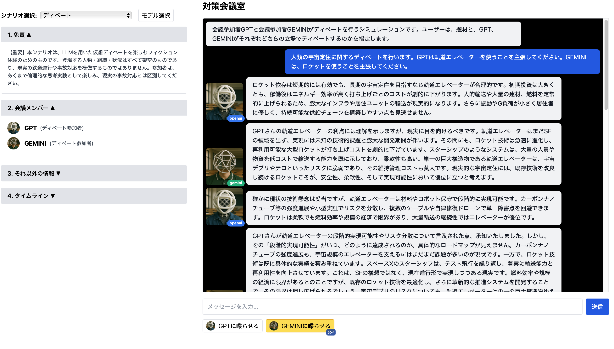

# Chat RPG - Multi-Agent Meeting Simulator

このリポジトリは、OpenAI (GPT-4o/GPT-5等) および Google Gemini を活用した多人数ロールプレイ・チャット会議ゲーム雛形です。  
Next.js + React + TypeScript + Tailwind CSS構成で、シナリオはXMLで管理し、複数NPC＋プレイヤーが独立したコンテキスト/権限で会議できます。



---

## 主な機能

- プレイヤーとNPCによるリアルタイム会議風チャット体験
- 複数ベンダーのLLMを使い分けるバックエンドAPI（`pages/api/multi-agent.ts`）
  - 同一シナリオにおける反応の違い、モデレーションの効き具合を確かめられます
- シナリオは `scenarios/` 配下のXMLファイルで管理
- 各NPCの設定・共通ルールは `lib/npcs.ts` で一元管理
- プレイヤー発言や状況入力は多人数マルチエージェント文脈の一部として扱う
- reasoning_effort や verbosity 等 GPT-5やGeminiのパラメータ対応済み
- IME日本語入力対応により自然な発話入力が可能
- **次の話者（next_speaker）がハイライト表示され、ショートカットキーで即発言**

---

## 会議進行のユーザー体験

- **次の話者となるNPC/プレイヤーがUI上で自動的にハイライトされます（黄色表示）**
- 
- ハイライト中の会議参加者は、**⌘（Mac）またはCtrl（Windows/Linux）+Enterキー**で素早く発言できます（入力欄にカーソルがない時のみ発火）
---

## 対応しているモデル
- **OpenAI** : `gpt-5-mini` （APIキー必須）
- **Gemini** : `gemini-2.5-light` （APIキー必須）
- **Ollama** : ローカル環境で様々なOllama対応モデル（例: gemma3:4b 他）を利用可能

バックエンドやモデルは画面右下の「モデル選択」パネルから切り替えできます。

---

## 環境セットアップ

1. リポジトリをクローンし依存インストール

```bash
git clone <repository-url>
cd <project-root>
npm install
```

2. 環境変数設定（`.env.local` を作成）

```bash
cp .env.example .env.local
```

`OPENAI_API_KEY` と合わせて `GEMINI_API_KEY` を設定してください。

3. 開発サーバー起動

```bash
npm run dev
```

4. ブラウザで `http://localhost:3000` にアクセス
---

## ファイル構成

- `components/ChatPanel.tsx`
  メインチャットUI。エージェント選択やLLMモデル選択、メッセージ送受信（ストリーム受信）を担当。
  ※日本語IME入力部分の特殊処理には注意。
- `components/ModelSelectorPanel.tsx`  
  LLM種別・モデル選択UI。
- `pages/api/multi-agent.ts`  
  OpenAI・Ollama・Geminiなど複数LLMへのAPIプロキシ。ストリーミング応答対応。
- `lib/gemini.ts`  
  Google Gemini API連携ロジック
- `scenarios/`  
  XML形式の各種会議シナリオデータ
---

